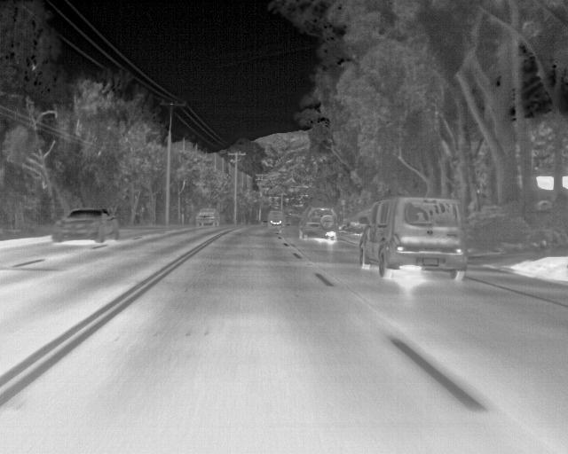
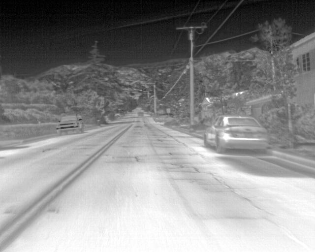
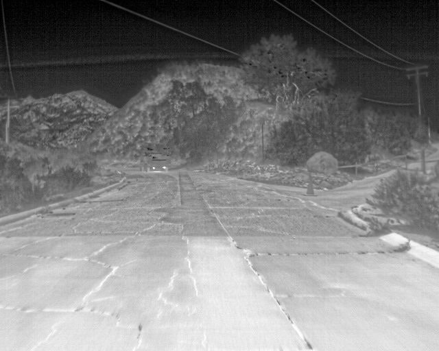

# VEHICLE DETECTION IN FLIR IMAGES
---
## • DATA PREPARATION

 **Dataset**: FLIR images

Samples

  


**Dataset Source**: [FLIR IMAGES](https://www.kaggle.com/deepnewbie/flir-thermal-images-dataset)

**Number of images used**: 300. 80% training, 20% validation

Annotated Using [labelImg](https://github.com/tzutalin/labelImg)

---
## • MODEL TRAINING
**Environment**: Google Colab

**Algorithm Used**: YOLOv3

**Number of epochs**: 25

**Highest Mean Average Precision (mAP)**: 0.6914

---

## •DEPLOYMENT

**Environment**: Using Anaconda, new Python environment is created to develop a GUI for deployment.

**Commands**: 
```python 
conda create --name <environment name> python=3.5
```

**Command for installing Dependencies:**
```python 
pip install opencv-python==4.1.2.30
pip uninstall keras-nightly -y
pip install keras==2.3.1
pip install tensorflow==1.14.0
pip install 'h5py==2.10.0' --force-reinstall
pip install imageai==2.1.5
pip install pyqt5
conda install -c anaconda pandas
```
**GUI:**
