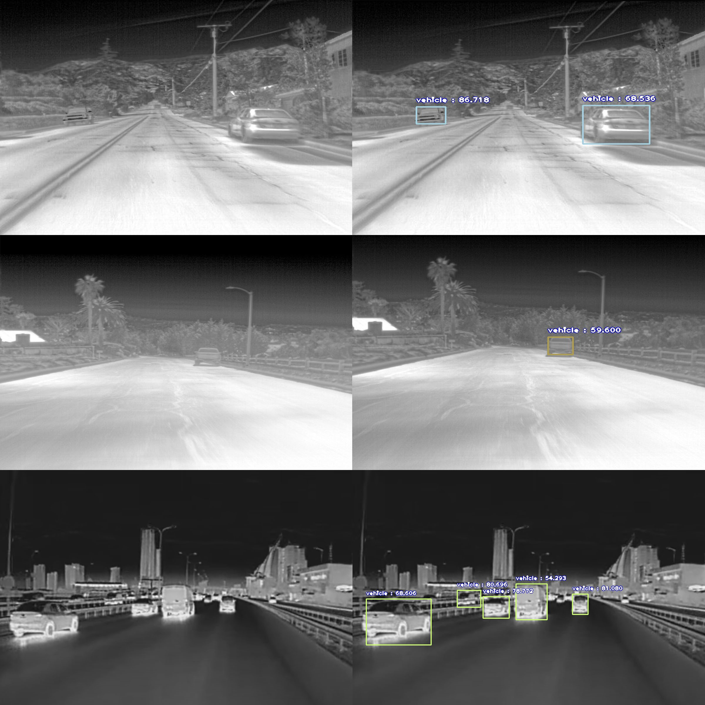

<h1 align="center"><b>VEHICLE DETECTION IN FLIR IMAGES</b></h1>

---

## DATA PREPARATION

 Dataset: FLIR images

Samples

  


Dataset Source: [FLIR IMAGES](https://www.kaggle.com/deepnewbie/flir-thermal-images-dataset)

Number of images used: 300. 80% training, 20% validation

Annotated Using [labelImg](https://github.com/tzutalin/labelImg)

---

## MODEL TRAINING
Environment: Google Colab

Algorithm Used: YOLOv3

Number of epochs: 20

Highest Mean Average Precision (mAP): 0.6914

---

<h1 align="center"><b>DEPLOYMENT</b></h1>

[Download Anaconda here](https://www.anaconda.com/products/individual)

[Anaconda and Jupyter Notebook Setup](https://www.youtube.com/watch?v=syijLJ3oQzU)

Type this in Anaconda prompt to create new environment

```python 
conda create --name <environment name> python=3.6
```
Activate the new environment

```python 
activate <environment name>
```
install Dependencies one by one 

(if there is an error in pip install 'h5py==2.10.0' --force-reinstall, try to remove the aphostraphes)
```python 
pip install opencv-python==4.1.2.30
pip uninstall keras-nightly -y
pip install keras==2.3.1
pip install tensorflow==1.14.0
pip install 'h5py==2.10.0' --force-reinstall
pip install imageai==2.1.5
pip install pyqt5
conda install -c anaconda pandas
```
check the installed packages using this command

```python 
conda list
```

**GUI:**


**Sample Output:**




[Original video](https://www.anaconda.com/products/individual)

